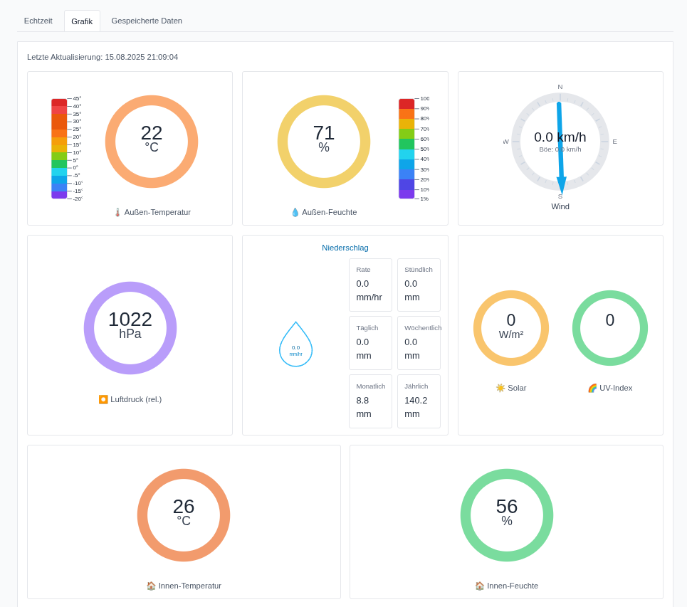
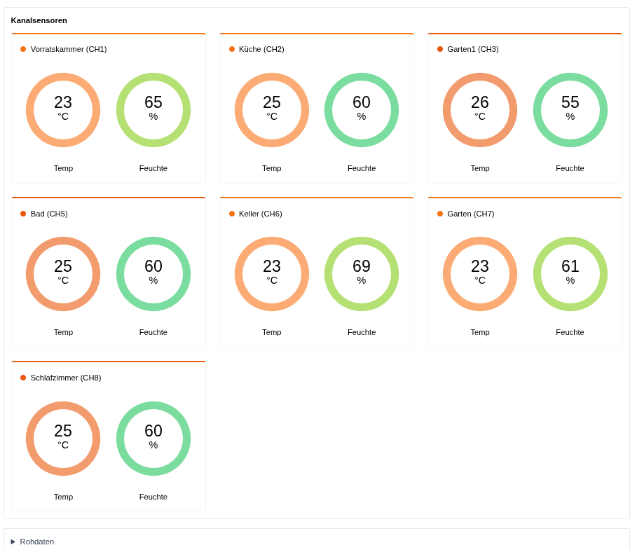
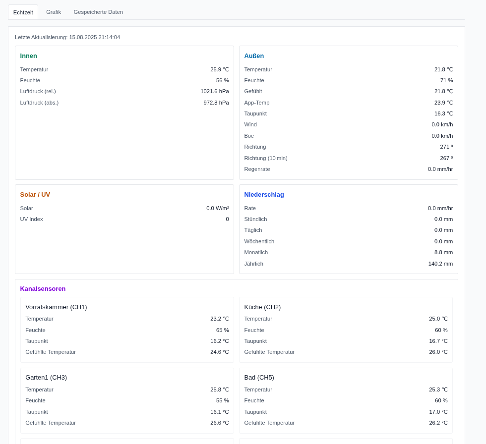
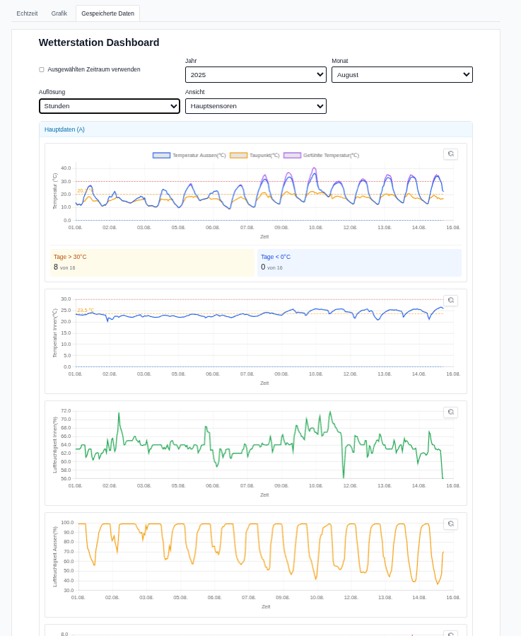

This is a [Next.js](https://nextjs.org) project bootstrapped with [`create-next-app`](https://nextjs.org/docs/app/api-reference/cli/create-next-app).

## Getting Started

First, run the development server:

```bash
npm run dev
# or
yarn dev
# or
pnpm dev
# or
bun dev
```

Open [http://localhost:3000](http://localhost:3000) with your browser to see the result.

You can start editing the page by modifying `app/page.tsx`. The page auto-updates as you edit the file.

This project uses [`next/font`](https://nextjs.org/docs/app/building-your-application/optimizing/fonts) to automatically optimize and load [Geist](https://vercel.com/font), a new font family for Vercel.

## Learn More

To learn more about Next.js, take a look at the following resources:

- [Next.js Documentation](https://nextjs.org/docs) - learn about Next.js features and API.
- [Learn Next.js](https://nextjs.org/learn) - an interactive Next.js tutorial.

You can check out [the Next.js GitHub repository](https://github.com/vercel/next.js) - your feedback and contributions are welcome!

## Deploy on Vercel

The easiest way to deploy your Next.js app is to use the [Vercel Platform](https://vercel.com/new?utm_medium=default-template&filter=next.js&utm_source=create-next-app&utm_campaign=create-next-app-readme) from the creators of Next.js.

Check out our [Next.js deployment documentation](https://nextjs.org/docs/app/building-your-application/deploying) for more details.

# ECOWITT WEATHER STATION
# DNT WLAN-Wetterstation WeatherScreen PRO

## Overview

Mobile-first dashboard for weather station data (Ecowitt - DNT) built with Next.js 15, React 19, and Tailwind CSS. CSV data stored on the weather station (microSD card) must be copied into the `DNT/` directory. From there, the app reads, processes, and aggregates the files (minute/hour/day) and visualizes them as interactive time series. Channel names (CH1–CH8) are configurable via JSON.

Supported weather stations:

- ECOWITT HP2551 Wi‑Fi Weather Station
- DNT WeatherScreen PRO (WLAN)
- Compatible ECOWITT/DNT models that save monthly CSV files

## Screenshots

### Grafik

<div align="center">
  
  
  
</div>

### Echtzeit

<p align="center">
  
</p>

### Gespeicherte Daten

<p align="center">
  
</p>

## Prerequisites

- Node.js 18+ (20+ recommended)
- CSV files in folder `DNT/` (outside version control, see `.gitignore`).

## Data location (`DNT/`)

- Copy the monthly CSVs from the weather station's microSD card into `DNT/`.
- Typical patterns:
  - Main data: `YYYYMMA.CSV` (e.g., `202508A.CSV`)
  - Allsensors: contains multiple channel blocks CH1..CH8 (e.g., `202508Allsensors_A.CSV`)
 - Sample CSVs (for testing) are provided in the project root:
   - `202501A.CSV` (Main A)
   - `202501Allsensors_A.CSV` (Allsensors)
   - Copy these files into `DNT/` to try the app without your own data.
- CSV properties (observed):
  - Delimiter: comma
  - Placeholder for missing values: `--`
  - Common date format `YYYY/M/D H:MM` (dashboard also supports ISO-like variants)
  - German headers (e.g., `Zeit`, `Luftfeuchtigkeit`, `Taupunkt`, `Wärmeindex`)

### Code Structure and Documentation

The project is structured to separate concerns, making it easier to navigate and maintain. All functions, classes, and components are fully documented with JSDoc comments.

-   **`src/app`**: Contains the main application pages, layouts, and API routes.
    -   **`src/app/api`**: All server-side API logic resides here. Each subdirectory corresponds to a specific endpoint.
-   **`src/components`**: Reusable React components used throughout the application.
-   **`src/lib`**: Core logic, utilities, and third-party library configurations.
    -   **`src/lib/db`**: Database-related logic, including data ingestion and querying with DuckDB.
-   **`src/contexts`**: React context providers for managing global state.
-   **`src/scripts`**: Standalone scripts for tasks like pre-warming the data cache.
-   **`src/types`**: TypeScript type definitions, including declarations for external modules.

## Channel name configuration

- File: `src/config/channels.json`
- Example:

```json
{
  "ch1": { "name": "Garten" },
  "ch2": { "name": "Keller" },
  "ch3": { "name": "Dachboden" }
}
```

Names appear in the dashboard (labels/options). Undefined channels fall back to their ID (e.g., CH4).

## API endpoints

- `GET /api/data/months`
  - Returns available months derived from filenames in `DNT/` (format `YYYYMM`).

- Allsensors
  - `GET /api/data/allsensors?month=YYYYMM&resolution=minute|hour|day`
  - `GET /api/data/allsensors?start=YYYY-MM-DD HH:MM&end=YYYY-MM-DD HH:MM&resolution=minute|hour|day`
  - Aggregates over Parquet via DuckDB (CSV fallback). Multiple months are merged automatically for range queries.

- Main (A)
  - `GET /api/data/main?month=YYYYMM&resolution=minute|hour|day`
  - `GET /api/data/main?start=YYYY-MM-DD HH:MM&end=YYYY-MM-DD HH:MM&resolution=minute|hour|day`
  - Aggregates over Parquet via DuckDB (CSV fallback). Multiple months are merged automatically for range queries.

- `GET /api/data/extent`
  - Returns global min/max timestamps detected across available data to power the global range slider.

- `GET /api/config/channels`
  - Returns `channels.json`.

- Forecast (Geosphere API + Meteoblue + Open-Meteo + OpenWeatherMap)
  - `GET /api/forecast?action=stations`
    - Returns TAWES weather stations grouped by Austrian states.
  - `GET /api/forecast?action=forecast&stationId=<ID>`
    - Returns temperature, precipitation, and wind forecast for the specified station (next ~60 hours).
    - Data source: Geosphere Austria ensemble forecast API (C-LAEF model).
  - `GET /api/forecast?action=meteoblue&stationId=<ID>`
    - Returns 7-day daily forecast for the specified station location.
    - Data source: Meteoblue basic-day package (FREE for non-commercial use).
    - Requires `METEOBLUE_API_KEY` environment variable.
  - `GET /api/forecast?action=meteogram&stationId=<ID>`
    - Returns meteogram image (14-day detailed forecast visualization).
    - Data source: Meteoblue meteogram image API (FREE for non-commercial use).
    - Returns WebP image format.
    - Requires `METEOBLUE_API_KEY` environment variable.
  - `GET /api/forecast?action=openmeteo&stationId=<ID>`
    - Returns 7-day daily forecast for the specified station location.
    - Data source: Open-Meteo DWD ICON API (FREE, no API key required).
    - Uses DWD ICON model for Central Europe with high accuracy.
    - No registration or API key needed.
  - `GET /api/forecast?action=openweather&stationId=<ID>`
    - Returns 5-day daily forecast for the specified station location.
    - Data source: OpenWeatherMap 5 Day / 3 Hour Forecast API (FREE).
    - Aggregates 3-hour forecasts into daily summaries.
    - Requires `OPENWEATHER_API_KEY` environment variable.

All API routes run in the Node.js runtime and read from the local filesystem (except forecast, which fetches from external APIs: Geosphere, Meteoblue, Open-Meteo, and OpenWeatherMap).

### Statistics (precomputed)

The Statistics feature computes daily aggregates from Main (A) minute/5‑minute data and exposes them via API.

- `GET /api/statistics`
  - Returns the latest precomputed statistics for all available years.
  - Optional `?year=YYYY` to filter for a single year.
  - Optional `?debug=1` to include column detection meta.
  - Optional `?debugDaily=YYYY` to include a small daily aggregation debug summary for a specific year.

- `POST /api/statistics/update` (also supports `GET`)
  - Forces a recompute and writes cache to `data/statistics.json`.

Background recompute

- Implemented in `src/instrumentation.ts`.
- On server startup, the cache is warmed once (`updateStatisticsIfNeeded()`).
- A daily interval recomputes statistics and refreshes the cache.

Payload (shape)

```jsonc
{
  "ok": true,
  "updatedAt": "2025-09-25T19:51:00.000Z",
  "years": [
    {
      "year": 2025,
      "temperature": {
        "max": 37.4,
        "maxDate": "2025-06-18",
        "min": -10.3,
        "minDate": "2025-01-14",
        "avg": 12.3,
        "over30": { "count": 38, "items": [{ "date": "2025-06-18", "value": 36.2 }] },
        "over25": { "count": 85, "items": [] },
        "over20": { "count": 123, "items": [] },
        "under0": { "count": 61, "items": [{ "date": "2025-01-10", "value": -1.2 }] },
        "under10": { "count": 1, "items": [{ "date": "2025-01-14", "value": -10.3 }] }
      },
      "precipitation": {
        "total": 557.1,
        "maxDay": 46.7,
        "maxDayDate": "2025-07-08",
        "minDay": 0,
        "minDayDate": "2025-01-01",
        "over20mm": { "count": 7, "items": [{ "date": "2025-07-08", "value": 46.7 }] },
        "over30mm": { "count": 2, "items": [] }
      },
      "wind": {
        "max": 65.0,
        "maxDate": "2025-06-18",
        "gustMax": 88.0,
        "gustMaxDate": "2025-06-18",
        "avg": 12.5
      },
      "months": [ { "year": 2025, "month": 6, "temperature": {}, "precipitation": {}, "wind": {} } ]
    }
  ],
  // present only when requested with ?debug=1
  "meta": {
    "parquetCount": 60,
    "columns": {
      "temperature": "Outdoor Temperature(℃)",
      "rain": "Daily Rain(mm)",
      "rainMode": "daily",
      "wind": "Wind(m/s)",
      "gust": "Gust(m/s)"
    }
  },
  // present only when requested with ?debugDaily=YYYY
  "daily": { "year": 2025, "totalDays": 365, "daysWithTemp": 365, "daysWithRain": 260, "sample": { "first": [], "last": [] } }
}
```

Notes

- Daily totals for rain are computed as:
  - max of daily‑cumulative columns (e.g., `Daily Rain(mm)`, `Regen/Tag(mm)`), otherwise
  - sum of hourly/minute columns (e.g., `Regen/Stunde(mm)`), otherwise
  - sum of generic rain columns (non‑rate, non‑month/year/week)
- Temperature thresholds use daily max (for >20/25/30 °C) and daily min (for <0/≤‑10 °C). Values include per‑date items.
- Units
  - Temperature in °C; rain in mm; wind in km/h (m/s inputs are converted ×3.6).

Examples

```bash
curl 'http://localhost:3000/api/statistics'
curl 'http://localhost:3000/api/statistics?year=2025'
curl -X POST 'http://localhost:3000/api/statistics/update'
curl 'http://localhost:3000/api/statistics?debug=1'
curl 'http://localhost:3000/api/statistics?debug=1&debugDaily=2025'
```

## Data (Ecowitt API v3)

The homepage is split into four tabs:

- **Realtime (Echtzeit)**: Fetches live data from Ecowitt API v3 via a server-side proxy (`/api/rt/last`). Values are shown as key metrics and as gauges/charts.
- **Grafik**: Visual, realtime gauges for the station: outdoor temperature and humidity (with gradient guides), wind compass with speed/gust, barometric pressure, rainfall KPIs (rate/hour/day/week/month/year), solar radiation, UV index, indoor temperature/humidity, plus mini‑gauges for CH1–CH8.
- **Stored data (Gespeicherte Daten)**: Historical dashboard over local CSVs via DuckDB/Parquet.
  - Default view: last available month; default resolution: day.
  - Modes: Main sensors (A) and Channel sensors (CH1–CH8). Channel dropdown supports single‑channel or viewing all channels.
  - Optional global time range: enable “Ausgewählten Zeitraum verwenden” to pick start/end and query across months.
  - Charts are interactive (zoom/pan/reset) and labels are localized.
  - Channel names are configurable via `src/config/channels.json`.
- **Prognose (Forecast)**: Quad weather forecast display from four independent sources.
  - **Geosphere Austria** 🇦🇹: Short-term forecast (~2.5 days / 60 hours)
    - Temperature (min/max/avg), precipitation, and wind speed
    - Data source: Geosphere API ensemble forecast (C-LAEF model) with 1-hour resolution
  - **Meteoblue** 🇨🇭: Extended 7-day forecast + 14-day meteogram (FREE API for non-commercial use)
    - Temperature (min/max/mean), precipitation, wind speed and gusts
    - Weather pictograms from Meteoblue
    - Detailed 14-day meteogram visualization with hourly data
    - Uses free basic-day package and meteogram image API
    - Requires `METEOBLUE_API_KEY` in `.env` (free API key from meteoblue.com)
  - **Open-Meteo DWD** 🌍: Extended 7-day forecast (FREE, no API key required)
    - Temperature (min/max/mean), precipitation, wind speed and gusts
    - WMO weather codes with emoji representation
    - Uses DWD ICON model for Central Europe with high accuracy
    - No registration or API key needed - completely free
  - **OpenWeatherMap** 🌍: Extended 5-day forecast (FREE API)
    - Temperature (min/max/day), precipitation with probability, wind speed and gusts
    - Weather icons and descriptions
    - Uses free 5 Day / 3 Hour Forecast API (aggregated to daily)
    - Requires `OPENWEATHER_API_KEY` in `.env` (free API key from openweathermap.org)
  - Station selection dropdown grouped by Austrian states (Bundesländer)
  - Uses `FORECAST_STATION_ID` as default station if no station selected
  - Last selected station is saved in localStorage
- **Analyse (Analysis)**: Forecast accuracy analysis comparing predictions with actual weather data.
  - **Automatic daily analysis at midnight (00:00)**: Compares yesterday's forecasts with actual weather data
  - **Persistent storage**: Analysis results stored in DuckDB `forecast_analysis` table
  - Shows Mean Absolute Error (MAE) and Root Mean Square Error (RMSE) for temperature, precipitation, and wind
  - Daily comparison details with error highlighting for all 4 forecast sources
  - Configurable time range (7-60 days) and station selection
  - **Demo data shown if no real analysis available yet** (first analysis runs after midnight)
  - Automatically stores forecasts daily via server background poller (runs at midnight, not every 24h)
  - Station ID configured via `FORECAST_STATION_ID` environment variable (default: 11035 - Wien)
  - Same station ID is used for all forecast sources (Geosphere, Meteoblue, Open-Meteo, OpenWeatherMap)
  - Color-coded display: red for max temperature, blue for min temperature and precipitation

### Backend Realtime Processing

The app now uses a server-side background poller (via Next.js instrumentation) to:

1. Fetch data from Ecowitt API at configurable intervals (`RT_REFRESH_MS` in `.env`)
2. Cache the latest data for quick client access (`/api/rt/last`)
3. Automatically archive data to monthly CSV files in `DNT/` directory:
   - `YYYYMMAllsensors_A.CSV` for channel data
   - `YYYYMMA.CSV` for main station data

This ensures seamless integration between realtime and historical data without client-side polling.

Realtime API routes:

- `GET /api/rt/last` — returns the latest cached data (used by the frontend)
- `GET /api/rt?all=1` — direct proxy to Ecowitt API (full payload)
- `GET /api/rt` — direct proxy to Ecowitt API (subset of data)

The system uses credentials from `eco.ts` (server-only) so your keys aren't exposed to the browser.

Docs: https://doc.ecowitt.net/web/#/apiv3en?page_id=17 (Getting Device Real-Time Data)

## Development

```bash
npm install
npm run dev
# usually opens http://localhost:3000
```

### Configuration (.env and eco.ts)

1) Environment variables

- Copy `env.example` to `.env` and adjust as needed.
- Supported variable(s):

```
NEXT_PUBLIC_RT_REFRESH_MS=300000  # Realtime refresh interval in ms (default 300000 = 5 min)
```

2) Ecowitt credentials (server-side)

- Copy `eco.example.ts` to `eco.ts` and fill in your values:
  - `applicationKey`
  - `apiKey`
  - `mac` (station MAC, e.g., `F0:08:D1:07:AF:83`)
  - `server` (usually `api.ecowitt.net`)
- `eco.ts` is imported by the server-side proxy at `src/app/api/rt/route.ts`.

Security notes:

- `.env*` files and `eco.ts` are ignored by Git (see `.gitignore`).
- Do not commit your real keys.

## Scripts

- `npm run prewarm`
  - Scans `DNT/` and materializes Parquet files under `data/parquet/{allsensors,main}/` for all detected months.
  - Logs per-month status (built, up-to-date, error) to the console.

- `npm run dev`
  - Runs the prewarm script first (via `predev` hook), then starts Next.js dev server.

- `npm run start`
  - Runs the prewarm script first (via `prestart` hook), then starts Next.js in production mode.

## Using the dashboard

- **Dataset**: Allsensors (CH1–CH8) or Main (A)
- **Month**: choose from detected `YYYYMM`
- **Resolution**: minute / hour / day (server-side average per bucket)
- **Allsensors**: choose metric (Temperature, Humidity, Dew Point, Heat Index) and channels
- **Main**: numeric columns are auto-detected and selectable

Note: The UI does not display raw source filenames (e.g., CSV lists). Data is served via DuckDB/Parquet.
Default view shows the last available month.

## Interactive charts (Zoom & Reset)

Charts use Chart.js with zoom and pan support:

- Mouse wheel: Horizontal zoom on the X‑axis.
- Pinch (touch/touchpad): Zoom.
- Shift + drag: Select a range to zoom (drag‑zoom).
- Ctrl + drag: Pan horizontally.
- Reset: Button at the top right of the chart (greyed out until you zoom) or double‑click the chart.

Notes:

- Tooltips and legend remain usable while zoomed.
- The Reset button is always visible; it becomes highlighted when a zoom is active.
- On touch devices, pinch‑zoom is active; panning requires Ctrl on desktop.

## Deployment notes

- The project reads from the filesystem (CSVs in `DNT/`). On platforms like Vercel, runtime files are not persisted. For production, consider:
  - your own server/VPS or Docker deployment with `DNT/` mounted
  - or an external storage/data source mounted server-side (and adapt file access as needed)

## DuckDB/Parquet (Node Neo)

This project uses DuckDB for fast queries and stores monthly CSV data on-the-fly as Parquet.

- Engine: `@duckdb/node-api` (DuckDB Node “Neo”)
- Database file: `data/weather.duckdb`
- Parquet targets:
  - `data/parquet/allsensors/YYYYMM.parquet`
  - `data/parquet/main/YYYYMM.parquet`

### Setup

```bash
# remove legacy package if present
npm remove duckdb

# install Neo client
npm install @duckdb/node-api
```

### Development (Node runtime)

```bash
npm run dev   # without --turbopack
```

Notes:

- API routes run with `export const runtime = "nodejs"` (not Edge runtime).
- `src/lib/db/duckdb.ts` dynamically imports `@duckdb/node-api` (prevents bundling native bindings).
- `next.config.ts` externalizes DuckDB native packages for the server build.

### On‑demand ingestion

- On first request for a month/range, CSV(s) from `DNT/` are read and written as Parquet (mtime check).
- Subsequent aggregations (minute/hour/day) run efficiently over Parquet via DuckDB.
- Fallback: if DuckDB/Parquet is unavailable, the API parses CSV directly.

### Prewarm at startup (optional but recommended)

Materialize Parquet files for all detected months before serving requests. This runs automatically before `dev`/`start`, and can also be run manually.

```bash
npm run prewarm           # manual
# or via hooks
npm run dev               # runs prewarm first
npm run start             # runs prewarm first
```

Console output example:

```
[prewarm] Scanning DNT/ for new CSV files and materializing Parquet via DuckDB...
[prewarm] Allsensors: found 39 month(s).
[prewarm] Allsensors 202508: built data/parquet/allsensors/202508.parquet
[prewarm] Allsensors 202507: up-to-date (data/parquet/allsensors/202507.parquet)
[prewarm] Main 202508: built data/parquet/main/202508.parquet
[prewarm] Main: 1 built, 38 up-to-date.
[prewarm] Done.
```

If a month fails to ingest, the script logs a per-month `ERROR` and continues with the next month.

### Timestamp detection (robust parsing)

CSV time columns vary (`Time`, `Zeit`, `DateUTC`, `DateTimeUTC`, etc.). The ingestion step introspects the CSV header to find the time column and parses common formats:

- `YYYY-M-D H:MM` / `YYYY/M/D H:MM` / `YYYY-MM-DDTHH:MM`
- with seconds variants: `...:SS`
- German: `DD.MM.YYYY HH:MM` (and with seconds)

This avoids binder/type errors and handles mixed datasets reliably.

### Useful API calls (test)

### Realtime

- curl

```bash
curl 'http://localhost:3000/api/rt/last'
curl 'http://localhost:3000/api/rt?all=1'
```

- fetch (client/server)

```ts
const rt = await fetch('/api/rt/last').then(r => r.json());
```

### Forecast Storage & Analysis

Forecasts are automatically stored **daily at midnight (00:00)** by the server background poller (configured via `FORECAST_STATION_ID` in `.env`). Analysis is calculated automatically after storage.

- Get stored analysis results (GET) **[Recommended]**

```bash
curl 'http://localhost:3000/api/forecast/analysis?stationId=11035&days=30'
```

- Manually store forecasts for a station (POST)

```bash
curl -X POST 'http://localhost:3000/api/forecast/store' \
  -H 'Content-Type: application/json' \
  -d '{"stationId": "11035"}'
```

- Compare forecasts with actual data on-demand (GET) **[Legacy]**

```bash
curl 'http://localhost:3000/api/forecast/compare?stationId=11035&days=30'
```

Response format for comparison:

```json
{
  "stationId": "11035",
  "days": 30,
  "data": {
    "dailyComparisons": [
      {
        "date": "2025-01-15",
        "actual": {
          "tempMin": -2.3,
          "tempMax": 4.1,
          "precipitation": 0.0,
          "windSpeed": 12.5
        },
        "forecasts": {
          "geosphere": {
            "tempMin": -1.8,
            "tempMax": 3.9,
            "precipitation": 0.2,
            "windSpeed": 11.2
          },
          "openweather": {
            "tempMin": -2.1,
            "tempMax": 4.3,
            "precipitation": 0.0,
            "windSpeed": 13.1
          }
        },
        "errors": {
          "geosphere": {
            "tempMinError": 0.5,
            "tempMaxError": 0.2,
            "precipitationError": 0.2,
            "windSpeedError": 1.3
          },
          "openweather": {
            "tempMinError": 0.2,
            "tempMaxError": 0.2,
            "precipitationError": 0.0,
            "windSpeedError": 0.6
          }
        }
      }
    ],
    "accuracyStats": {
      "geosphere": {
        "sampleSize": 25,
        "tempMin": { "mae": 0.8, "rmse": 1.1 },
        "tempMax": { "mae": 0.7, "rmse": 0.9 },
        "precipitation": { "mae": 0.3, "rmse": 0.5 },
        "windSpeed": { "mae": 2.1, "rmse": 2.8 }
      },
      "openweather": {
        "sampleSize": 25,
        "tempMin": { "mae": 0.6, "rmse": 0.8 },
        "tempMax": { "mae": 0.5, "rmse": 0.7 },
        "precipitation": { "mae": 0.2, "rmse": 0.4 },
        "windSpeed": { "mae": 1.8, "rmse": 2.3 }
      }
    }
  },
  "generated": "2025-01-16T10:30:00.000Z"
}
```

### Data (CSV/DuckDB-backed)

- Months and global extent

```bash
curl 'http://localhost:3000/api/data/months'
curl 'http://localhost:3000/api/data/extent'
```

- Main (A) — by month or by time range

```bash
curl 'http://localhost:3000/api/data/main?month=202501&resolution=day'
curl 'http://localhost:3000/api/data/main?start=2025-01-01%2000:00&end=2025-01-31%2023:59&resolution=hour'
```

- Allsensors (CH1–CH8) — by month or by time range

```bash
curl 'http://localhost:3000/api/data/allsensors?month=202501&resolution=hour'
curl 'http://localhost:3000/api/data/allsensors?start=2025-01-01%2000:00&end=2025-02-15%2000:00&resolution=day'
```

- fetch example

```ts
const res = await fetch('/api/data/allsensors?month=202501&resolution=hour');
const json = await res.json();
```

- Config (channel names)

```bash
curl 'http://localhost:3000/api/config/channels'
```

- Forecast (Geosphere API + Meteoblue + Open-Meteo + OpenWeatherMap)

```bash
curl 'http://localhost:3000/api/forecast?action=stations'
curl 'http://localhost:3000/api/forecast?action=forecast&stationId=11035'
curl 'http://localhost:3000/api/forecast?action=meteoblue&stationId=11035'
# Get meteogram image (returns WebP image)
curl 'http://localhost:3000/api/forecast?action=meteogram&stationId=11035' > meteogram.webp
curl 'http://localhost:3000/api/forecast?action=openmeteo&stationId=11035'
curl 'http://localhost:3000/api/forecast?action=openweather&stationId=11035'
```

- Forecast Analysis (same API calls as frontend)

```bash
# Get analysis data (used by frontend)
curl 'http://localhost:3000/api/forecast/analysis?stationId=11229&days=7'

# Get default station config
curl 'http://localhost:3000/api/config/forecast-station'

# Check database contents (forecasts and analysis tables)
curl 'http://localhost:3000/api/debug/db'
```

### Testing Forecast Analysis

Use the provided test script to verify the complete forecast analysis system:

```bash
# Test with default station (11035) and 7 days
./test-forecast-analysis.sh

# Test with custom station and days
./test-forecast-analysis.sh 11035 14
```

The script will:
1. Call `/api/forecast/analysis` (same as frontend)
2. Show database contents (forecasts and forecast_analysis tables)
3. Display station configuration
4. Provide a summary of the system status

**Expected output after midnight poller runs:**
- ✓ Forecasts stored for today and next days (4 sources)
- ✓ Analysis data available (comparing today with yesterday's forecasts)
- ✓ Frontend shows real data instead of demo data

## Troubleshooting

- **No months found**: Are CSVs present in `DNT/` and named `YYYYMM*.CSV`?
- **Empty charts**: Check if headers match expected patterns and values are not all `--`.
- **Time axis looks off**: Check the date format is `YYYY/M/D H:MM` (or ISO-like alternative).
- **Build/TS errors**: Ensure `tsconfig.json` has `baseUrl`/`paths` set for `@/*` (provided).
- **Module not found `@duckdb/node-bindings-*/duckdb.node`**: Ensure `@duckdb/node-api` is installed, Turbopack is disabled in dev (`npm run dev` without the flag), routes run in Node runtime, and `src/lib/db/duckdb.ts` uses dynamic import. Remove `.next/` and restart if needed.
- **Unknown module type (@mapbox/node-pre-gyp)**: Remove legacy `duckdb` (`npm remove duckdb`), use `@duckdb/node-api` only.

## Attribution

This project was built with assistance from Windsurf (agentic AI coding assistant) and GPT-5.
