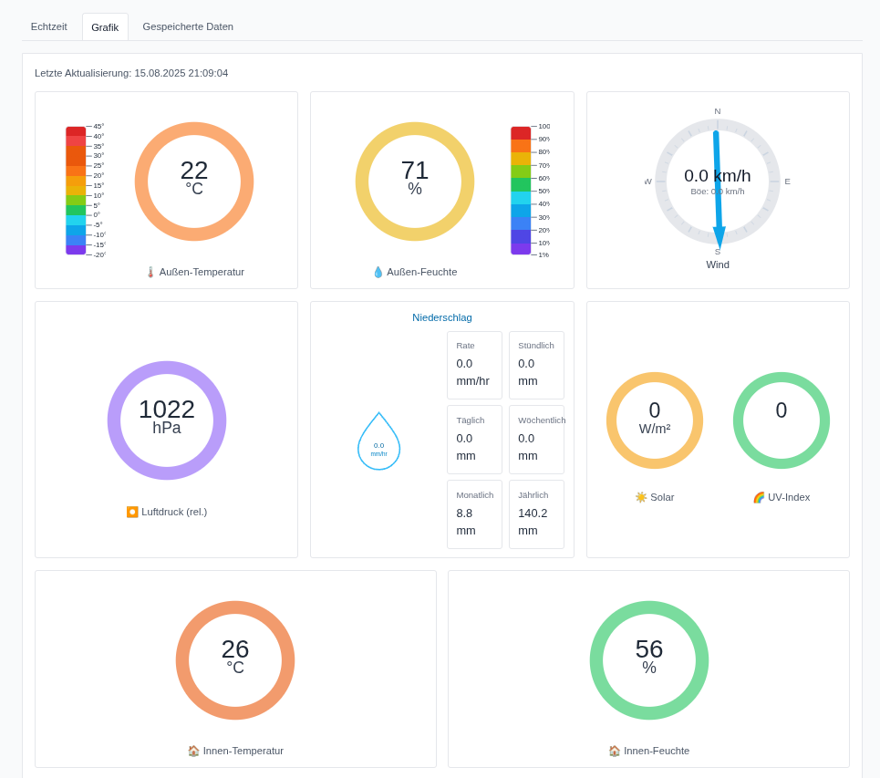
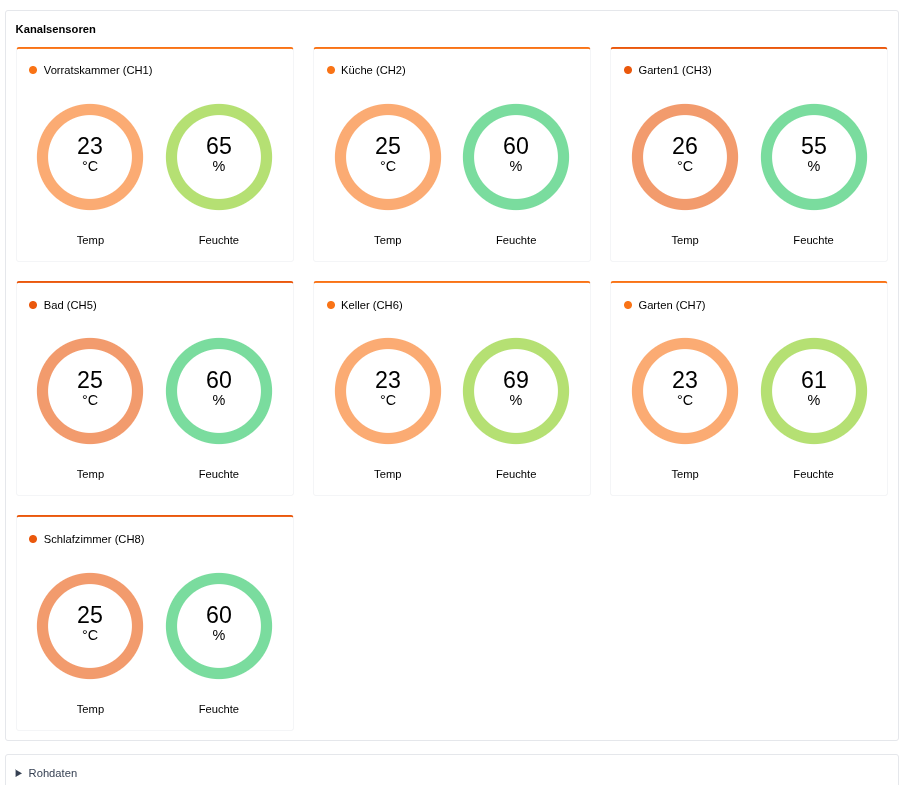
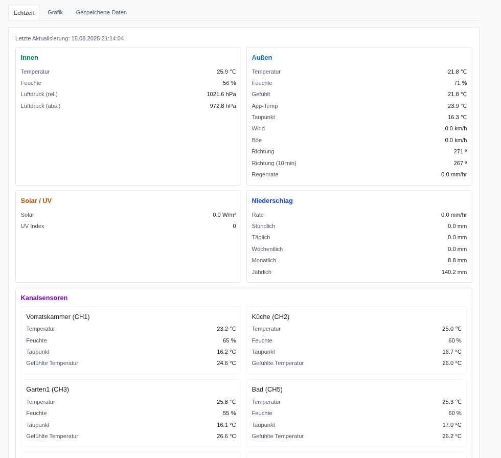
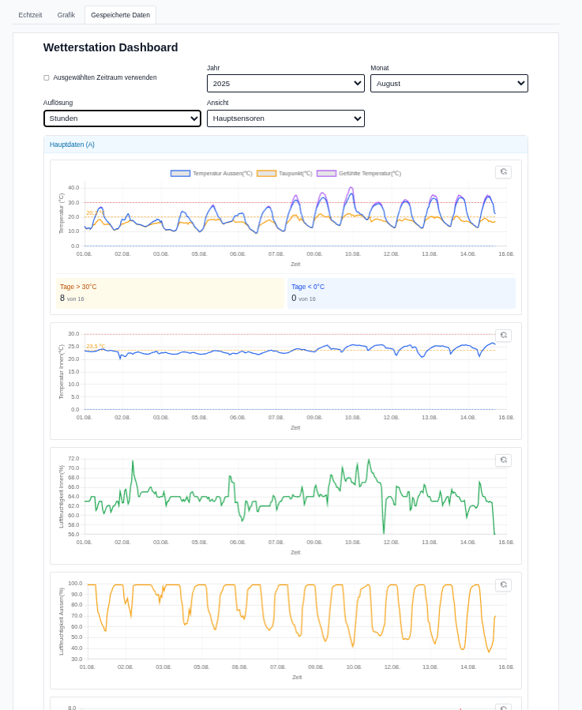

# Ecowitt Weather Dashboard

Dashboard fuer Ecowitt- und DNT-WLAN-Wetterstationen mit Live-Daten, lokaler CSV-Historie, Statistiken und Forecast-Vergleich. Die Anwendung laeuft als Next.js-App mit Node.js-Routen, liest Wetterstationsdateien aus `DNT/`, materialisiert sie als Parquet und fragt Live- sowie Forecast-Daten serverseitig ab.

## Funktionsumfang

- **Echtzeit**: aktuelle Ecowitt-API-v3-Daten ueber einen serverseitigen Proxy und Cache.
- **Grafik**: Gauges fuer Temperatur, Luftfeuchte, Wind, Luftdruck, Regen, Solarstrahlung, UV und CH1-CH8.
- **Prognose**: Forecasts aus Geosphere Austria, Open-Meteo DWD ICON, optional Meteoblue und OpenWeatherMap.
- **Analyse**: Forecast-Genauigkeit gegen lokal gemessene Wetterdaten mit MAE/RMSE.
- **Gespeicherte Daten**: interaktive Chart.js-Zeitreihen fuer Main- und Allsensors-CSV-Daten.
- **Statistik**: Jahres-, Monats-, Bereichs- und Kanalstatistiken aus DuckDB/Parquet.
- **Internationalisierung**: Deutsch und Englisch via `i18next`.

## Screenshots

| Grafik | Grafik 2 |
| --- | --- |
|  |  |

| Echtzeit | Archiv |
| --- | --- |
|  |  |

## Technik

- Next.js `16.2.4` mit App Router
- React `19.2`
- TypeScript `6`
- Tailwind CSS `4`
- DuckDB via `@duckdb/node-api`
- Chart.js mit `chartjs-plugin-zoom`
- `suncalc` fuer Sonnen-/Mondzeiten

Alle API-Routen, die lokale Dateien oder DuckDB nutzen, laufen im Node.js-Runtime. Das Projekt ist daher fuer einen Server/VPS oder Docker mit persistenten Volumes gedacht, nicht fuer eine serverlose Umgebung ohne persistentes Dateisystem.

## Schnellstart

```bash
npm install

cp env.example .env
cp eco.example.ts eco.ts

mkdir -p DNT data
cp 202501A.CSV 202501Allsensors_A.CSV DNT/

npm run dev
```

Danach die App unter `http://localhost:3000` oeffnen.

Wichtig: `npm run dev` startet zuerst `npm run prewarm`. Wenn `DNT/` fehlt, kann das Vorwaermen der CSV-Daten nicht laufen. Fuer einen ersten Test koennen die beiden Beispiel-CSV-Dateien aus dem Repository nach `DNT/` kopiert werden.

## Konfiguration

### Ecowitt-Zugangsdaten

`eco.example.ts` nach `eco.ts` kopieren und ausfuellen:

```ts
applicationKey: "YOUR_APPLICATION_KEY_HERE",
apiKey: "YOUR_API_KEY_HERE",
mac: "AA:BB:CC:DD:EE:FF",
server: "api.ecowitt.net"
```

`eco.ts` wird nur serverseitig importiert und ist in `.gitignore` ausgeschlossen.

### Umgebungsvariablen

`env.example` nach `.env` kopieren. Relevante Variablen:

| Variable | Bedeutung |
| --- | --- |
| `RT_REFRESH_MS` | Intervall des serverseitigen Live-Pollers in Millisekunden, Default `300000`. |
| `NEXT_PUBLIC_RT_REFRESH_MS` | Clientseitiges Refresh-Intervall im Realtime-Tab. |
| `FORECAST_STATION_ID` | Geosphere-Station fuer Forecast-Speicherung und Analyse, Default `11035`. `ALL` verarbeitet alle Stationen. |
| `OPENWEATHER_API_KEY` | Optional, aktiviert OpenWeatherMap-Forecasts. |
| `METEOBLUE_API_KEY` | Optional, aktiviert Meteoblue-Forecast und Meteogramm. |
| `ADMIN_API_TOKEN` | Token fuer administrative API-Routen. |
| `WEATHER_ADMIN_TOKEN` | Fallback-Name fuer denselben Admin-Token. |

Admin-Routen akzeptieren entweder `Authorization: Bearer <token>` oder `x-admin-token: <token>`.

### Kanalnamen

Die Anzeigenamen fuer CH1-CH8 stehen in `src/config/channels.json`:

```json
{
  "ch1": { "name": "Vorratskammer" },
  "ch2": { "name": "Kueche" }
}
```

Nicht konfigurierte Kanaele fallen auf ihre ID zurueck.

## Datenablage

Die Anwendung erwartet lokale CSV-Dateien im Ordner `DNT/`.

Typische Dateinamen:

- Main-Daten: `YYYYMMA.CSV`, zum Beispiel `202501A.CSV`
- Kanal-Daten: `YYYYMMAllsensors_A.CSV`, zum Beispiel `202501Allsensors_A.CSV`

Beobachtete CSV-Eigenschaften:

- Komma als Trennzeichen
- `--` als Platzhalter fuer fehlende Werte
- Zeitspalten wie `Zeit`, `Time`, `DateUTC` oder `DateTimeUTC`
- Zeitformate wie `YYYY/M/D H:MM`, ISO-nahe Varianten und `DD.MM.YYYY HH:MM`
- deutsche oder englische Sensornamen mit Einheiten in Klammern

Generierte Laufzeitdaten:

- `data/weather.duckdb`
- `data/parquet/main/YYYYMM.parquet`
- `data/parquet/allsensors/YYYYMM.parquet`
- `data/statistics.json`
- `DNT/rt-last.json`
- `temp-minmax-data.json`

Diese Datenpfade sind in `.gitignore` ausgeschlossen.

## Hintergrundjobs

`src/instrumentation.ts` registriert beim Serverstart mehrere Jobs:

- Live-Poller: fragt Ecowitt API v3 ab, schreibt `DNT/rt-last.json` und archiviert Messwerte in monatliche Main-/Allsensors-CSV-Dateien.
- Statistik-Warmup: berechnet Statistik-Caches beim Start und danach taeglich neu.
- Forecast-Poller: speichert Forecasts fuer `FORECAST_STATION_ID` taeglich im Zeitfenster 20:00-20:30 und fuehrt beim Start/Catchup nach Bedarf einen Lauf aus.
- Forecast-Analyse: vergleicht gespeicherte Forecasts mit lokalen Main-Daten und schreibt Ergebnisse in DuckDB.

## Scripts

```bash
npm run prewarm   # CSVs aus DNT/ als Parquet materialisieren
npm run dev       # prewarm + Next.js Dev-Server
npm run build     # Produktionsbuild mit Webpack
npm run start     # prewarm + Next.js Production Server
```

`prewarm` prueft pro Monat die CSV- und Parquet-Mtime und baut nur fehlende oder veraltete Parquet-Dateien neu.

## API-Ueberblick

### Live und Geraet

- `GET /api/config/channels` - CH1-CH8 Anzeigenamen aus `src/config/channels.json`
- `GET /api/rt/last` - letzter gecachter Live-Datensatz
- `GET /api/rt` - direkter Ecowitt-Proxy fuer eine kleine Auswahl
- `GET /api/rt?all=1` - direkter Ecowitt-Proxy fuer den vollen Payload
- `GET /api/device/info` - Zeitzone, Latitude und Longitude der Station
- `GET /api/temp-minmax` - lokale Temperatur-Min/Max-Daten

### Historische Daten

- `GET /api/data/months` - erkannte Monate aus `DNT/`
- `GET /api/data/extent` - globaler Zeitbereich
- `GET /api/data/main?month=YYYYMM&resolution=minute|hour|day`
- `GET /api/data/main?start=YYYY-MM-DDTHH:MM&end=YYYY-MM-DDTHH:MM&resolution=minute|hour|day`
- `GET /api/data/allsensors?month=YYYYMM&resolution=minute|hour|day`
- `GET /api/data/allsensors?start=YYYY-MM-DDTHH:MM&end=YYYY-MM-DDTHH:MM&resolution=minute|hour|day`

Beispiel:

```bash
curl 'http://localhost:3000/api/data/main?month=202501&resolution=day'
curl 'http://localhost:3000/api/data/allsensors?start=2025-01-01T00:00&end=2025-01-31T23:59&resolution=hour'
```

### Statistik

- `GET /api/statistics`
- `GET /api/statistics?year=2025`
- `GET /api/statistics/daily?year=2025`
- `GET /api/statistics/range?month=YYYYMM`
- `GET /api/statistics/range?start=YYYY-MM-DDTHH:MM&end=YYYY-MM-DDTHH:MM`
- `GET /api/statistics/channels?ch=ch1&month=YYYYMM`
- `GET /api/statistics/channels?ch=ch1&start=YYYY-MM-DDTHH:MM&end=YYYY-MM-DDTHH:MM`

Admin:

- `POST /api/statistics/update`
- `POST /api/temp-minmax/update`

### Forecast und Analyse

- `GET /api/forecast?action=stations`
- `GET /api/forecast?action=forecast&stationId=11035` - Geosphere Austria
- `GET /api/forecast?action=openmeteo&stationId=11035` - Open-Meteo DWD ICON
- `GET /api/forecast?action=openweather&stationId=11035` - OpenWeatherMap, braucht API-Key
- `GET /api/forecast?action=meteoblue&stationId=11035` - Meteoblue, braucht API-Key
- `GET /api/forecast?action=meteogram&stationId=11035` - Meteoblue-WebP-Meteogramm
- `GET /api/forecast/analysis?stationId=11035&days=30`
- `GET /api/forecast/compare?stationId=11035&days=30` - Legacy-On-Demand-Vergleich
- `GET /api/config/forecast-station`

Admin:

- `POST /api/forecast/store`
- `POST /api/forecast/analyze`
- `POST /api/forecast/backfill`
- `GET /api/dforecast`
- `GET /api/debug/db`

Admin-Beispiel:

```bash
curl -X POST 'http://localhost:3000/api/forecast/store' \
  -H 'Authorization: Bearer <ADMIN_API_TOKEN>' \
  -H 'Content-Type: application/json' \
  -d '{"stationId":"11035"}'
```

## Projektstruktur

```text
src/app/                  Next.js Seiten, Layout und API-Routen
src/components/           React-Komponenten fuer Tabs, Charts, Gauges und Statistik
src/contexts/             Realtime-Context fuer Clientdaten
src/lib/                  CSV-, Zeit-, Statistik-, Astro-, Realtime- und DB-Logik
src/lib/db/               DuckDB-Verbindung und CSV->Parquet-Ingestion
src/config/channels.json  CH1-CH8 Anzeigenamen
src/locales/              i18next-Uebersetzungen
src/scripts/prewarm.ts    Parquet-Vorwaermung
```

## Docker

```bash
cp env.example .env
cp eco.example.ts eco.ts
mkdir -p DNT data

docker compose up --build -d
```

`docker-compose.yml` bindet folgende Pfade ein:

- `./DNT:/app/DNT`
- `./data:/app/data`
- `./src/config:/app/src/config`
- `./eco.ts:/app/eco.ts`

Die App lauscht im Compose-Setup auf `127.0.0.1:3010`.

## Fehlersuche

- **`DNT/` fehlt**: Ordner anlegen und CSVs hineinkopieren; `prewarm` liest direkt aus diesem Pfad.
- **Keine Monate gefunden**: Dateinamen muessen mit `YYYYMM` beginnen und auf `.CSV` enden.
- **Leere Charts**: CSV-Header, Zeitformat und fehlende Werte (`--`) pruefen.
- **Forecast-Quelle fehlt**: Open-Meteo und Geosphere funktionieren ohne eigenen Key; Meteoblue und OpenWeatherMap brauchen `.env`-Keys.
- **Admin-Route liefert 503**: `ADMIN_API_TOKEN` oder `WEATHER_ADMIN_TOKEN` ist nicht gesetzt.
- **DuckDB/native binding Fehler**: `@duckdb/node-api` muss installiert sein; fuer Builds werden die DuckDB-Pakete in `next.config.ts` serverseitig externalisiert.
- **Serverless Deployment verliert Daten**: `DNT/`, `data/` und `eco.ts` muessen persistent gemountet werden.

## Sicherheit

`.env*`, `eco.ts`, `DNT/`, `data/`, DuckDB-Dateien und generierte Temperaturdaten werden nicht versioniert. Echte API-Keys und Stationsdaten sollten nicht committet werden.
